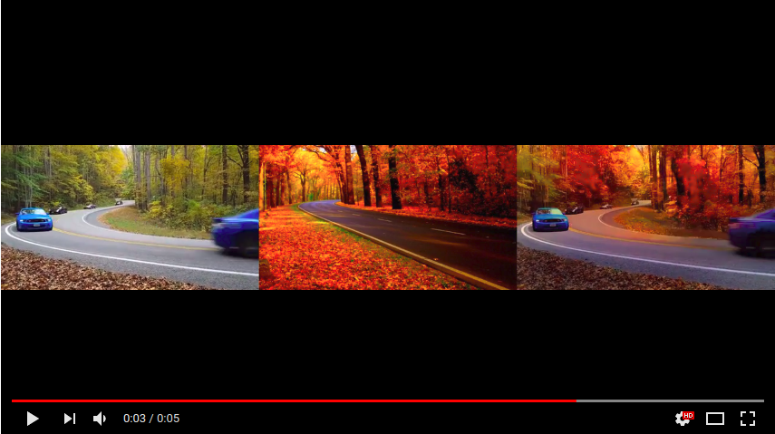

This is a project was implemented me, Michael Honke and Rahul Iyer as a part of Deep learning course (offered fall 2017) at University of Waterloo. Photo-realistic style transfer is a technique which transfers colour from one reference domain to another domain by using deep learning and optimization techniques. Here, we present a technique which we use to transfer style and colour from a reference image to entire video. In accomplishing this, we take help from two papers:

* [Deep Photo Style Transfer Luan et al.](https://arxiv.org/abs/1703.07511)
* [Artistic style transfer for videos Ruder et al.](https://arxiv.org/abs/1604.08610)

<video controls="controls" 
       class="video-stream" 
       x-webkit-airplay="allow" 
       data-youtube-id="N9oxmRT2YWw" 
       src="https://youtu.be/-pqUG2jHBWQ"></video>
       
<iframe width="420" height="315"
src="https://youtu.be/-pqUG2jHBWQ">
</iframe>

<iframe width="420" height="315"
src="https://youtu.be/gJZgNHYuPiw">
</iframe>

<iframe width="420" height="315"
src="https://youtu.be/wb4n1JcWMxo">
</iframe>
